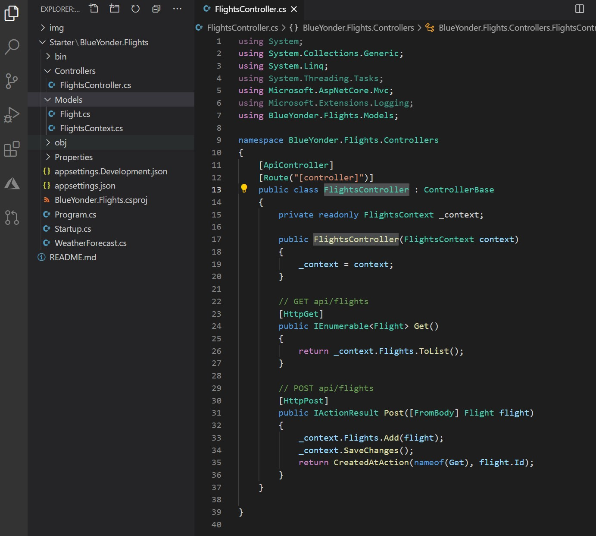

# Module 1: Overview of Service and Cloud Technologies

# Lab: Exploring the Work Environment

1. **Nombres y apellidos:** Francisco Javier Moreno Quevedo
2. **Fecha:** 17/12/2020
3. **Resumen del Ejercicio:**  Crear el controlador de la aplicacion
4. **Dificultad o problemas presentados y como se resolvieron:** Ninguna

- Ejercicio 3: Creating a Web API Class

  - creamos el controlador FlightsController

  - Añadimos el constructor y las acciones Get y post
  
    

  

